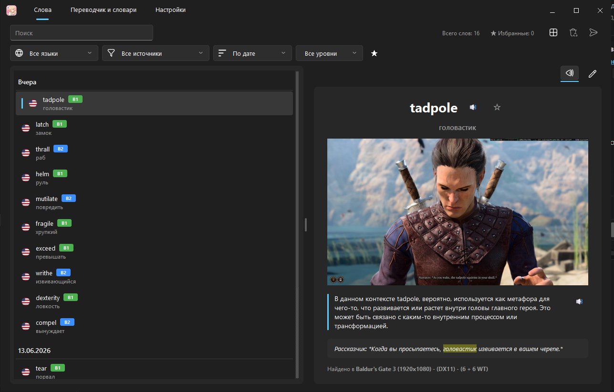

<p align="center">
  
</p>

<h1 align="center">WordSnap</h1>

<p align="center">
  <b>Look up any word on your screen — instantly.</b><br>
  On-screen OCR + AI translation + a personal vocabulary trainer for language learners.
</p>

<p align="center">
  
</p>

---

**WordSnap** lets you point at any word on your screen — in a game, a video, a PDF, a
browser, anywhere — and instantly get its **OCR-recognized text**, an **AI translation**,
and a **dictionary entry** in a small popup right next to the word. Everything you look
up can be saved to a **personal word list** with screenshots, tags and CEFR levels, so
you can review and study your vocabulary later.

> Inspired by *Looktionary*. Built with Python + PySide6 (Qt) for Windows.

## Features

- **Global hotkey / mouse-button lookup** — press a configurable hotkey (default
  `Alt+Q`) or a mouse button anywhere to look up the word under your cursor.
- **Screen OCR** — recognizes on-screen text using Windows' built-in OCR (with a
  Tesseract fallback), isolating the sentence around your cursor.
- **AI translation ("Translator")** — contextual translation of the recognized
  sentence via **Groq** or **Google Gemini**, with the target word highlighted.
- **AI dictionary ("Looktionary")** — dictionary form, CEFR level (A1–C2),
  phonetic transcription, part-of-speech, definition, translation and synonyms.
- **Offline dictionary (Oxford slot)** — basic English lookups without internet.
- **Animated, adaptive popup** — pops in with a bounce, slides so it never covers the
  word, and auto-switches light/dark based on the screen brightness under your cursor.
- **Personal word list** — favorites ★, custom **#tags**, full-text search, filters by
  **language / source / level**, sorting by **date or level**, a word counter,
  multi-select bulk delete, and view/edit modes. Click a screenshot to open it full-size.
- **Text-to-speech** — listen to the pronunciation of any word.
- **Export** — CSV, JSON, or **Anki** (TSV with `` cards + copied media).
- **Themes** — dark / light / follow-system, and a **RU / EN** interface language.
- **Keyboard shortcuts**, **system tray**, and a custom **frameless Windows 11 UI**
  with native edge resizing and animated tab navigation.

## How it works

1. You press the global hotkey (or mouse button) while hovering over a word.
2. The app captures the screen region around the cursor (`app/capture.py`), runs OCR
   (`app/ocr.py`) and isolates the sentence/column containing the word.
3. A popup (`app/ui/popup.py`) appears next to the word, showing the sources configured
   in **Settings → Translator & dictionaries**: Translator, Looktionary, Oxford.
4. You can bookmark the result to save it to your personal word list, stored together
   with a cropped screenshot and source app/game name (`app/storage.py`).

## Keyboard shortcuts (Words tab)

| Shortcut | Action |
|---|---|
| `Ctrl+F` | focus search |
| `Space` | speak the current word |
| `Delete` | delete selected |
| `Ctrl+D` | toggle favorite |
| `←` / `→` | previous / next word |

## Project layout

```
main.py                  Entry point: tray, global hotkeys, popup wiring
app/
  config.py               Settings (data/settings.json), languages
  capture.py              Screen capture (mss)
  ocr.py                  OCR + sentence/column isolation
  gemini.py               AI providers (Groq / Gemini)
  translator.py           Translation helpers
  tts.py                  Text-to-speech
  storage.py              Word list + screenshots, export (CSV/JSON/Anki)
  hotkeys.py              Global hotkey listener (keyboard + mouse)
  ui/
    main_window.py         Window, custom titlebar, native resize, theming
    words_page.py          "Words" tab — personal word list
    dicts_page.py          "Translator & dictionaries" tab — sources & languages
    settings_page.py        "Settings" tab — theme, language, hotkeys, OCR, AI
    popup.py                The animated lookup popup
    widgets.py              Reusable widgets, SVG icons, FluentRadio, toggles
    theme.py                Dark / light / system palettes + Qt stylesheet
    i18n.py                 RU / EN interface translations
    overlay.py              Screen overlay / word highlight
assets/
  icon.png                  App icon (used in this README too)
  screenshot.png            App screenshot shown in this README
  svg/                       SVG icons used throughout the UI
data/                        Created on first run (settings, words, screenshots)
```

## Requirements

- Windows 10/11 (built-in Windows OCR; reduced functionality elsewhere).
- Python 3.11+ and the dependencies in `requirements.txt`:

```
pip install -r requirements.txt
```

## Running from source

```
py main.py
```

(Use `py` — the Python launcher — if `python` is not on your PATH, e.g.
`py .\lookupper\main.py` from the repo root.) On first run, `data/settings.json` and
`data/words.json` are created automatically.

## Configuration

Open the **Settings** tab to configure the theme, interface language, hotkeys, OCR
language, and the AI provider + API key:

- Groq key: https://console.groq.com/keys
- Gemini key: https://aistudio.google.com/app/apikey

## Building a standalone .exe

```
build_exe.bat
```

Bundles `main.py` with the required `winrt` OCR modules and copies `assets/` next to
the executable. Output: `dist/Lookupper/Lookupper.exe` (run **that** one, not anything
in `build/`). Add `assets/icon.ico` to give the `.exe` a custom file icon.

## License

**PolyForm Noncommercial License 1.0.0.**

You are free to **use, copy, fork, modify and share** this project **for noncommercial
purposes** (personal use, study, research, etc.). **Commercial use — including selling
the app or paid modifications — is not allowed.**

Full text: https://polyform-noncommercial.org/  · See the `LICENSE` file in this repo.
